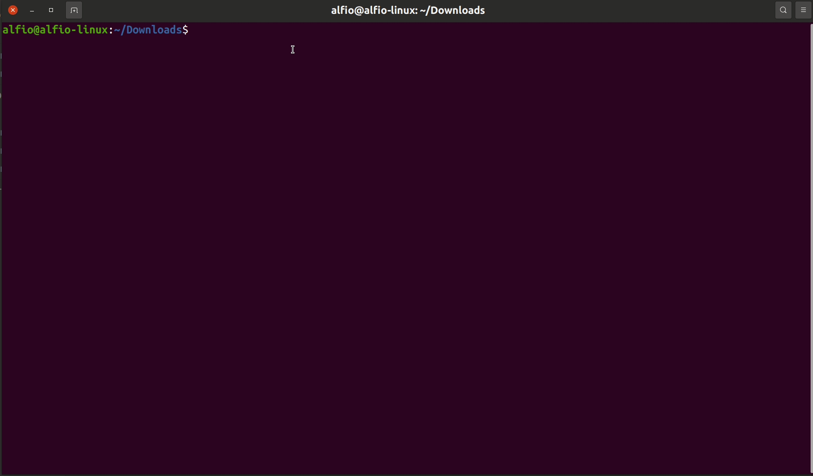

# NAME
	linux_doc_words_counter - count all words and characters of multiple .doc|.txt files

# DESCRIPTION
linux_doc_words_counter is a simple bash script that count all words and characters of multiple documents.

# INSTALLATION
`sudo mv linux_doc_words_counter /usr/bin`

`sudo chmod +x /usr/bin/linux_doc_words_counter`

# USAGE

# REQUIREMENTS
- a linux distro
- sudo privileges
- `sudo apt install unzip` package
- `sudo apt install catdoc` package
       
# AUTHOR: 
linux_doc_words_counter is written by Alfio Salanitri <www.alfiosalanitri.it> and are licensed under the terms of the GNU General Public License, version 2 or higher.
